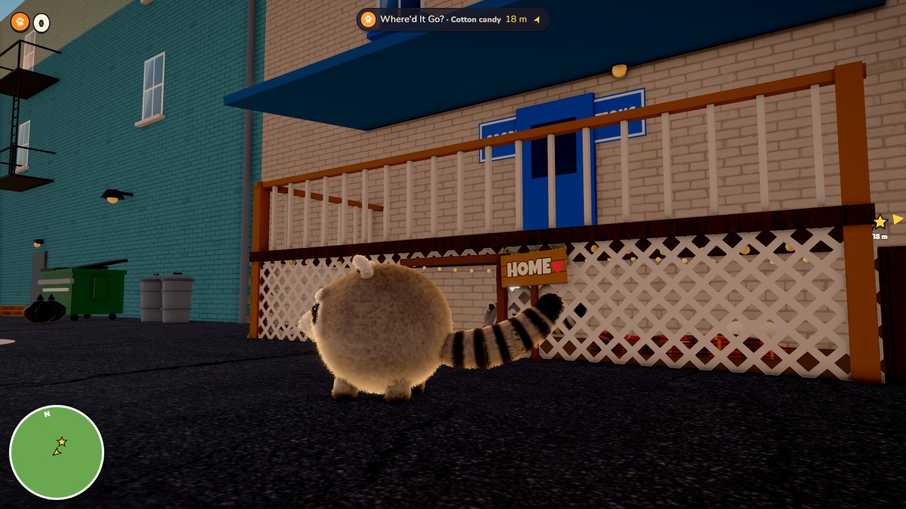
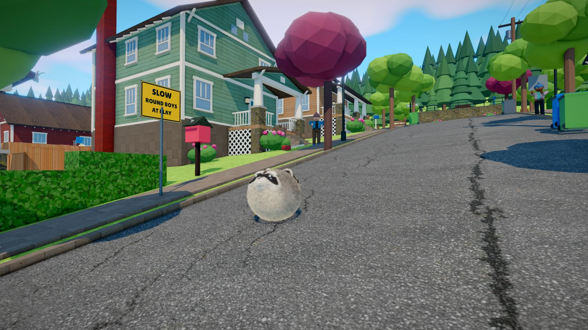
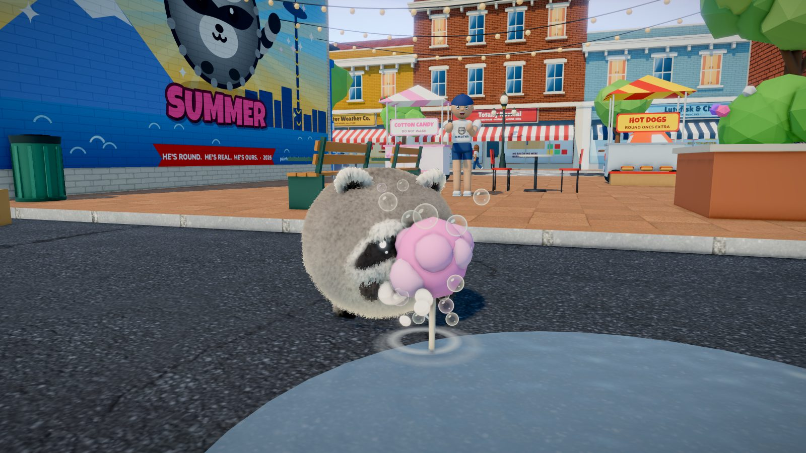
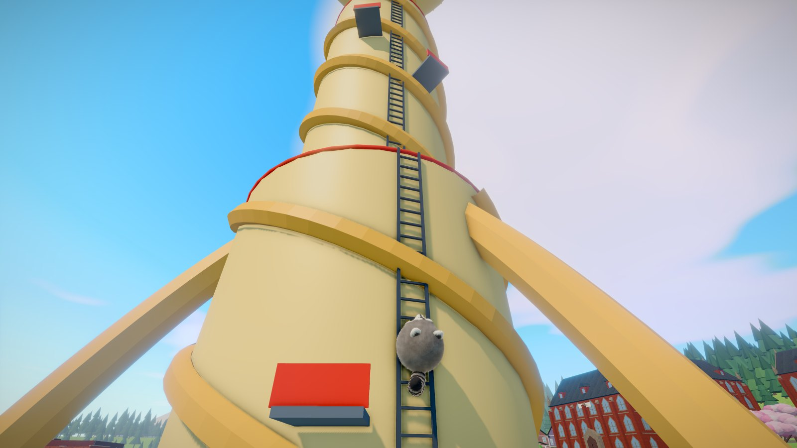
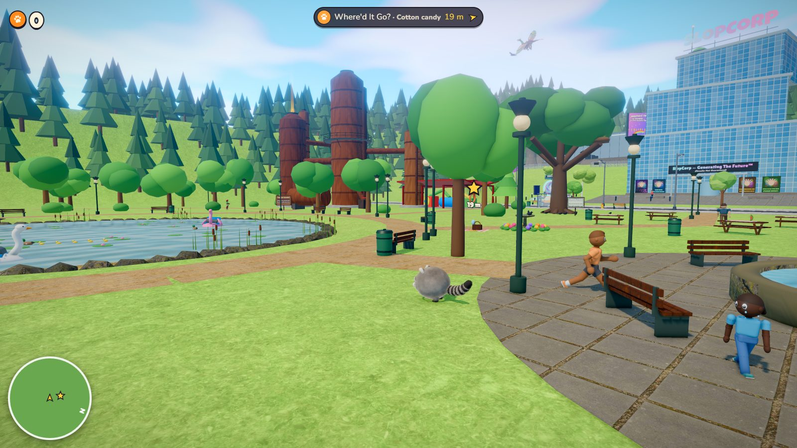
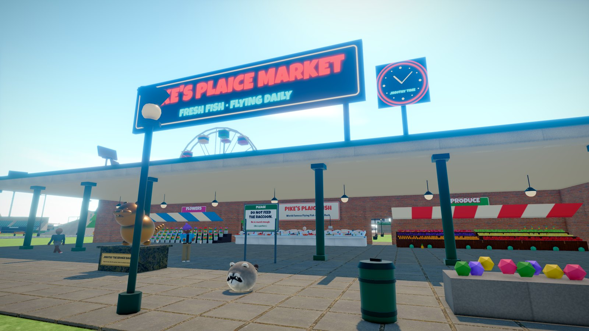
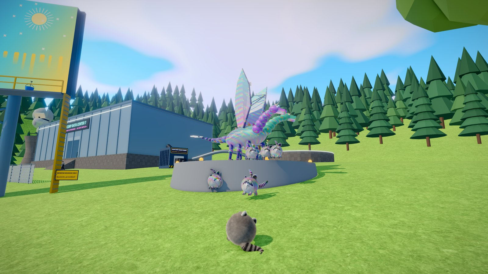
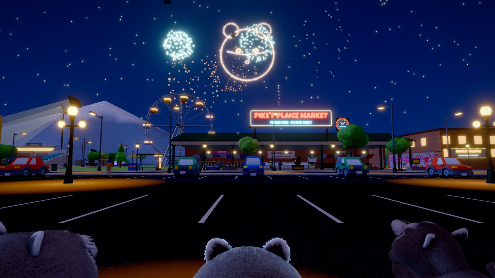

# Jimothy Simulator

> He's round. He's real. He's washing your phone.

A Goat-Simulator-style physics sandbox starring **Jimothy**, the round, short-spined wild raccoon of Ballard, Seattle
who went viral in July 2026. Wash things. Roll. Climb the Space Noodle. Steal a whole pizza. Unplug the AI slop factory.
Bring your mom snacks.

## ▶ Play in your browser: https://greenninjada.github.io/jimothy-simulator/

No install, no login. Keyboard + mouse, gamepad, or touch (phones/tablets).

| | |
|---|---|
|  |  |
| *Home: the den under Goodwheel Thrift's back porch* | *Tumble St. Slow, round boys at play.* |
|  |  |
| *Washing cotton candy. (Where'd it go?)* | *Climbing the Space Noodle* |
|  |  |
| *Gasworks-ish Park (that's the Slop Dragon up there)* | *Pike's Plaice Market — fresh fish, flying daily* |
|  |  |
| *SlopCorp's AI campus: fake Jimothys and a seven-legged dragon* | *Jimothy Summer Forever* |

## What's in it

* **A raccoon, not a goat.** Grabby hands instead of a lick (carry, drag, steal from pedestrians, hang onto moving cars),
  a round-boy body slam instead of a headbutt, wall climbing, swimming, and — because he's basically a sphere —
  **Tuck & Roll** into a bowling ball. Flop into a ragdoll whenever you like.
* **Washing.** Raccoons wash things. Hold anything near water (puddles, fountains, pools, the bay, sprinklers — or
  anywhere at all when Seattle rains) and scrub. Cotton candy dissolves. Cash gets laundered. Phones become
  "water resistant". AI-generated fake Jimothys melt.
* **Ballard-ish Seattle**: Old Ballard Ave and the thrift store where it all began, Downtown and the climbable
  **Space Noodle**, the Residential Hills (Tumble St is for rolling), the **University of Washing**, SlopCorp's AI campus,
  a gas-works-ish park, the Locks and their fish ladder, **Pike's Plaice Market** and the Gum Wall, and
  **Tee-Hee Park** for Jimothy Night.
* **The real story, as a game**: the phone video where he was mistaken for a cat, "he just looked like a Jimothy",
  the **Jimothy Summer** proclamation, the **honorary degree**, winning the **Salmon Run**, the **$20,000 gold rookie card**.
* **Heartwarming**: bring Mom snacks, find five lost kits (they follow you home in a conga line), roll with Danny
  (who might be your dad), trade shiny things with the crows, visit Grandma Rosie at night, wash a sad kid's teddy.
  Finish the family story for a fireworks finale.
* **AI slop, lovingly mocked**: six-fingered Slopothys roam town speaking in apologies, a two-headed seven-legged
  Slop Dragon you can ride, SlopBot™ offering to generate you a raccoon instead, a billboard that needs a good wash,
  and a data center with a very large plug.
* **Goat-Sim chaos**: ~60 ragdolling pedestrians, traffic, trampolines, propane BBQs, raccoon cannons, a Ferris wheel,
  dumpster diving, the KRCN breaking-news ticker reacting to everything you do, 50 Instincts (objectives),
  12 mutators, 10 golden bobbleheads, photo mode, slow-mo, day/night and Seattle weather.

## Controls

| Action | Keyboard / Mouse | Gamepad |
|---|---|---|
| Move / camera | WASD / mouse | Left stick / right stick |
| Sprint | Shift | LT / L3 |
| Jump (hold into a wall to climb) | Space | A |
| Grabby Hands | Left click / E | X / RT |
| Bonk (or throw what you hold) | Right click / F | RB |
| Wash (near water) | R | Y |
| Tuck & Roll | Q | B |
| Flop | Z | LB |
| Chitter | C | D-pad up |
| Instincts / pause | Tab / Esc | Back / Start |
| Photo mode · map · slow-mo · back to den | V · M · T · H | R3 |

Stuck on an Instinct? `QA_OBJECTIVES.md` doubles as a hint sheet (secrets marked).

## Real-life note

The real Jimothy is a wild animal who is, by all accounts, healthy and happy. Please admire him from a distance and
never feed wild raccoons. This is an unofficial fan game; nobody owns Jimothy (IP lawyers checked).

## Development

```
npm install
npm run dev      # http://127.0.0.1:5173
npm run build    # static site in dist/ (GitHub Pages deploys main automatically)
```

Built with Three.js, Rapier, pmndrs postprocessing, Vite and TypeScript. Assets are CC0 (Kenney, Poly Haven,
OpenGameArt music) or made for this project — see `CREDITS.md`. Design notes in `DESIGN.md`, engine guide in
`AGENTS.md`, the story of the night it was made in `DEVLOG.md`.

Tools: `node tools/playtest.mjs` (scripted gameplay regression, `--group obj` for every Instinct),
`node tools/soak.mjs` (random-input soak test), `node tools/shot.mjs` (headless screenshots).

*Made in one night by a team of AI agents while their human slept. The raccoon is real. Everything else is
load-bearing slop.*
